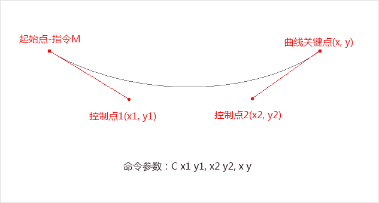
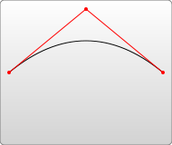
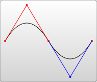

# SVG - 路径path的贝塞尔曲线指令 #

## 贝塞尔曲线基本概要 ##

“贝塞尔曲线” 可以绘制任何曲线，包括直线。

贝塞尔曲线的兄弟姐妹有点多：线性贝塞尔曲线、二次方贝塞尔曲线、三次方贝塞尔曲线、四次方贝塞尔曲线、五次方贝塞尔曲线、……。

线性贝塞尔曲线演示动画，t在[0,1]区间

二次贝塞尔曲线演示动画，t在[0,1]区间

三次贝塞尔曲线演示动画，t在[0,1]区间

四次贝塞尔曲线演示动画，t在[0,1]区间

五次贝塞尔曲线演示动画，t在[0,1]区间

以上动图都是基于数学公式，目前阶段接触公式不利于我们的学习，因此，大家感受一下就可以了。

## SVG贝塞尔曲线指令概要 ##

SVG中path的元素，也就是路径绘制，属性名称是`d`, 具体值是由专门的“指令字母+坐标值”实现的，例如下面这个简单代码示意：

    <path d="M10 10L90 90" stroke="#000000" style="stroke-width: 5px;"></path>

标准的指令字母是10个，外加1个非标准的

<table cellspacing="1" cellpadding="0" class="params_table">
  <thead>
    <tr>
      <th>命令</th>
      <th>名称</th>
      <th>参数</th>
    </tr>
  </thead>
  <tbody>
    <tr>
      <td>M</td>
      <td>moveto  移动到</td>
      <td>(x y)+</td>
    </tr>
    <tr>
      <td>Z</td>
      <td>closepath  关闭路径</td>
      <td>(none)</td>
    </tr>
    <tr>
      <td>L</td>
      <td>lineto  画线到</td>
      <td>(x y)+</td>
    </tr>
    <tr>
      <td>H</td>
      <td>horizontal lineto  水平线到</td>
      <td>x+</td>
    </tr>
    <tr>
      <td>V</td>
      <td>vertical lineto  垂直线到</td>
      <td>y+</td>
    </tr>
    <tr>
      <td>C</td>
      <td>curveto  三次贝塞尔曲线到</td>
      <td>(x1 y1 x2 y2 x y)+</td>
    </tr>
    <tr>
      <td>S</td>
      <td>smooth curveto  光滑三次贝塞尔曲线到</td>
      <td>(x2 y2 x y)+</td>
    </tr>
    <tr>
      <td>Q</td>
      <td>quadratic Bézier curveto  二次贝塞尔曲线到</td>
      <td>(x1 y1 x y)+</td>
    </tr>
    <tr>
      <td>T</td>
      <td>smooth quadratic Bézier curveto  光滑二次贝塞尔曲线到</td>
      <td>(x y)+</td>
    </tr>
    <tr>
      <td>A</td>
      <td>elliptical arc  椭圆弧</td>
      <td>(rx ry x-axis-rotation large-arc-flag sweep-flag x y)+</td>
    </tr>
    <tr>
      <td>R</td>
      <td><a href="http://en.wikipedia.org/wiki/Catmull–Rom_spline#Catmull.E2.80.93Rom_spline">Catmull-Rom curveto</a>*  Catmull-Rom曲线</td>
      <td>x1 y1 (x y)+</td>
    </tr>
  </tbody>
</table>

其中，Catmull-Rom曲线不是标准的SVG命令。

如果指令字母是大写的，例如`M`, 则表示坐标位置是绝对位置；如果指令字母小写的，例如`m`, 则表示坐标位置是相对位置。

其中，有5个指定属于基本指令，你也可以理解为“好理解好上手好记忆”的指令，见下表：

<table border="0" cellspacing="1" cellpadding="0" class="params_table">
  <tbody>
    <tr>
      <th scope="col">指令字母（绝对坐标）</th>
      <th scope="col">中文含义</th>
      <th scope="col">参数示意</th>
      <th scope="col">具体说明</th>
    </tr>
    <tr>
      <td>M</td>
      <td>移动到(moveTo)</td>
      <td>x,y</td>
      <td>路径起始点坐标</td>
    </tr>
    <tr>
      <td>Z</td>
      <td>闭合路径(closepath)</td>
      <td>&nbsp;</td>
      <td>将路径的开始和结束点用直线连接</td>
    </tr>
    <tr>
      <td>L</td>
      <td>直线(lineTo)</td>
      <td>x,y</td>
      <td>当前节点到指定(x,y)节点，直线连接</td>
    </tr>
    <tr>
      <td>H</td>
      <td>水平直线</td>
      <td>x</td>
      <td>保持当前点的y坐标不变，x轴移动到x, 形成水平线</td>
    </tr>
    <tr>
      <td>V</td>
      <td>垂直直线</td>
      <td>y</td>
      <td>保持当前点的x坐标不变，y轴移动到y, 形成垂直线</td>
    </tr>
  </tbody>
</table>

除了这5个参数及直来直往的指令，剩下的，除了弧形命令A(Arcs)，就都是与贝塞尔曲线相关的命令了, **合称“厕所切图(CSQT)”**。

## CS 组合  和 QT组合 ##

- CS:三次贝塞尔曲线
- QT:二次贝塞尔曲线

**三次贝塞尔曲线**需要定义一个点和两个控制点，所以用`C`命令创建三次贝塞尔曲线，需要设置三组坐标参数

    C x1 y1, x2 y2, x y (or c dx1 dy1, dx2 dy2, dx dy)

这里的最后一个坐标(x,y)表示的是曲线的终点，另外两个坐标是控制点，(x1,y1)是起点的控制点，(x2,y2)是终点的控制点。

示例：

	<svg width="190px" height="160px" version="1.1" xmlns="http://www.w3.org/2000/svg">
	
	  <path d="M10 10 C 20 20, 40 20, 50 10" stroke="black" fill="transparent"/>
	  <path d="M70 10 C 70 20, 120 20, 120 10" stroke="black" fill="transparent"/>
	  <path d="M130 10 C 120 20, 180 20, 170 10" stroke="black" fill="transparent"/>
	  <path d="M10 60 C 20 80, 40 80, 50 60" stroke="black" fill="transparent"/>
	  <path d="M70 60 C 70 80, 110 80, 110 60" stroke="black" fill="transparent"/>
	  <path d="M130 60 C 120 80, 180 80, 170 60" stroke="black" fill="transparent"/>
	  <path d="M10 110 C 20 140, 40 140, 50 110" stroke="black" fill="transparent"/>
	  <path d="M70 110 C 70 140, 110 140, 110 110" stroke="black" fill="transparent"/>
	  <path d="M130 110 C 120 140, 180 140, 170 110" stroke="black" fill="transparent"/>
	
	</svg>

效果图：

你可以将若干个贝塞尔曲线连起来，从而创建出一条很长的平滑曲线。如果将一个点的控制点在它的另一侧建立一个对称点（斜率不变），可以通过一个简写的命令来实现，这个命令是S（或s）。（这段话可以这样理解：S命令前面可以是一条C命令创建的三次贝赛尔曲线，这时候，S命令跟在C命令的后面，就可以用比较简单的参数，生成一个与前面那个相对称的三次贝塞尔曲线。仔细看一下后面的图例，可以帮助理解。另外，S命令也可以跟在S命令后面。）

    S x2 y2, x y (or s dx2 dy2, dx dy)

`S`命令可以用来创建与之前那些曲线一样的贝塞尔曲线，但是，如果S命令跟在一个C命令或者另一个S命令的后面，它的第一个控制点，就会被假设成前一个控制点的对称点。如果S命令单独使用，前面没有C命令或者另一个S命令，那么它的两个控制点就会被假设为同一个点(其表现就跟二次贝塞尔曲线的Q一模一样)。下面是S命令的语法示例，如图所示，左侧的控制点用红色标示，与它对称的控制点用蓝色标示。

示例：

	<svg width="190px" height="160px" version="1.1" xmlns="http://www.w3.org/2000/svg">
	  <path d="M10 80 C 40 10, 65 10, 95 80 S 150 150, 180 80" stroke="black" fill="transparent"/>
	</svg>

效果图：

大家要把关注点放在蓝线上面。S指令会自动补出一个对称的控制点（蓝线部分）。于是，就会有连续的平滑曲线啦！

**二次贝塞尔曲线Q**，它比三次贝塞尔曲线简单，只需要一个控制点，用来确定起点和终点的曲线斜率。因此它需要两组参数，控制点和终点坐标。

    Q x1 y1, x y (or q dx1 dy1, dx dy)

示例：

	<svg width="190px" height="160px" version="1.1" xmlns="http://www.w3.org/2000/svg"">
	  <path d="M10 80 Q 95 10 180 80" stroke="black" fill="transparent"/>
	</svg>

效果图：

就像三次贝塞尔曲线有一个`S`命令，二次贝塞尔曲线有一个差不多的T命令，可以通过更简短的参数，延长二次贝塞尔曲线。

	T x y (or t dx dy)

和之前一样，快捷命令T会通过前一个控制点，推断出一个新的控制点。这意味着，在你的第一个控制点后面，可以只定义终点，就创建出一个相当复杂的曲线。需要注意的是，T命令前面必须是一个Q命令，或者是另一个T命令，才能达到这种效果。如果T单独使用，那么控制点就会被认为和终点是同一个点，所以画出来的将是一条直线。

示例：

	<svg width="190px" height="160px" version="1.1" xmlns="http://www.w3.org/2000/svg">
	  <path d="M10 80 Q 52.5 10, 95 80 T 180 80" stroke="black" fill="transparent"/>
	</svg>

效果图：

虽然三次贝塞尔曲线拥有更大的自由度，但是两种曲线能达到的效果总是差不多的。具体使用哪种曲线，通常取决于需求，以及对曲线对称性的依赖程度。

## 参考资料： ##

- [深度掌握SVG路径path的贝塞尔曲线指令](http://www.zhangxinxu.com/wordpress/2014/06/deep-understand-svg-path-bezier-curves-command/)
- [SVG教程 - 路径](https://developer.mozilla.org/zh-CN/docs/Web/SVG/Tutorial/Paths#Curve_commands)